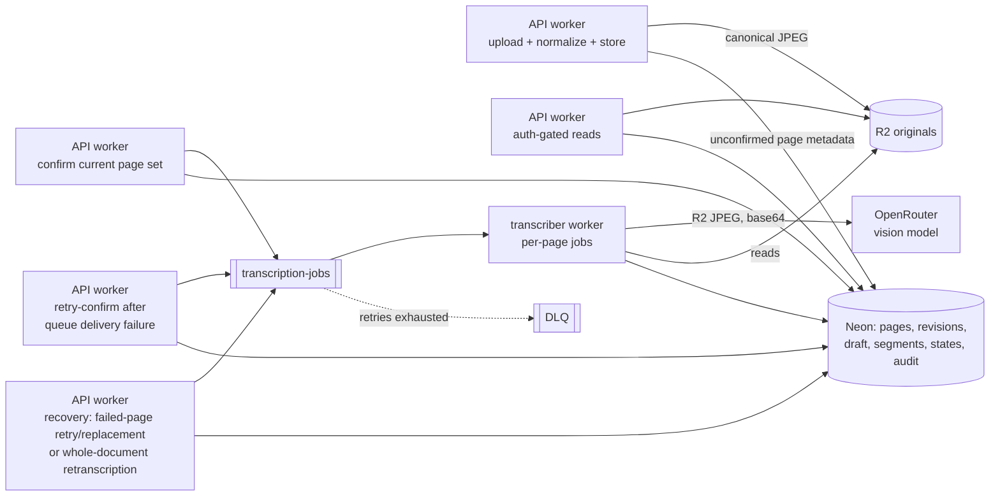

# Assignment Reader — Infrastructure Analysis

## Document purpose

This document analyzes the Assignment Reader mockups (`mockups/`) and product requirements
(`product-doc.md`) against the current ClassPrints platform and enumerates the infrastructure
changes and additions required to support the product. It identifies what systems must be
stood up, what existing systems extend to cover the new workload, and in what order they sit
on the critical path. It is an engineering analysis, not an implementation plan. Decisions
made with weighed alternatives are recorded in Appendix A.

## Verified platform facts

Two platform facts constrain the design below and were verified against current Cloudflare
documentation at the time of writing:

- **HEIC is a supported Cloudflare Images input format** and is not Enterprise-gated (only
  AVIF is). The hosted-image size limit is 10 MB, matching the product's per-page limit
  exactly ([Limits and formats](https://developers.cloudflare.com/images/get-started/limits/)).
  PRD resolved decision 1's server-side HEIC → JPEG normalization is natively supportable
  without third-party transcoders.
- **Workers accept request bodies up to 100 MB** on standard plans
  ([Limits](https://developers.cloudflare.com/workers/platform/limits/)). Per-page uploads
  (10 MB max) can proxy through the API worker; no presigned direct-to-storage upload
  machinery is required for this release.

## Current platform inventory

The ClassPrints monorepo (this worktree: `apps/seating-backend`, `seating-worker`,
`email-worker`, `seating-frontend`; `packages/server`, `shared`, `seating-shared`) already
provides:

| Need (from PRD/mockups) | Covered by |
|---|---|
| Teacher accounts, sessions, verification | Better Auth in `packages/server` |
| Relational persistence + migrations pipeline | Neon Postgres via Hyperdrive; `database/migrations/*.sql` run per env in CI |
| Operator-controlled model config pattern | `seating-worker` OpenRouter integration (`LLM_API_KEY` secret, hardcoded `MODELS` fallback list) |
| Async job queue + dead-letter recovery | `seating-jobs` / `seating-jobs-dlq` and `email-jobs` queues, `max_retries: 3` |
| Billing, transactional email, rate limiting, metrics | Stripe via secrets/vars (no Cloudflare binding), `send_email` binding + Email Worker, `API_RATELIMITER`, Analytics Engine datasets |
| Staging → production deploy pipeline | `plan/infrastructure-staging-prod-pipeline-1.md` (wrangler.jsonc per env, bootstrap runbook, evergreen PR) |

## Gap summary

The repository currently has **no object storage binding, no file-upload path (no multipart
handling anywhere), no image processing pipeline, and no vision-model integration** — all
net-new, none anticipated by the existing worker fleet or schema. (The repo's lack of a
realtime channel is not a gap; see Appendix A, D1.)

## Required systems

### 1. Domain schema (Neon / Postgres)

New migrations defining:

- `classes` (teacher-owned, archival status) → `students` (teacher-managed roster records,
  no auth identity) and `assignments` (optional `max_score`).
- **One** ordered assignment-materials document per assignment, stored as
  `assignment_material_versions` rows (implementation-plan table name): changing
  successfully processed current materials creates a new draft version, prior versions
  stay viewable read-only, and no submission's recorded review context changes
  retroactively (resolved decisions 8, 9). There is no separate `assignment_materials`
  table.
- `submissions` (one per student per assignment) with review state and grading fields
  (`score` up to two decimals, comments, graded state).
- `pages` — the atomic unit for both document types: immutable identity, position (order),
  per-page processing state, source-image storage key, draft content,
  `edited_by_teacher` flag, and error message. Per-page state carries decisions 5 and 6.
- `question_segments` (JSONB per page and page transcription revision) — parsed question
  rows that drive the workspace's per-question grading UI (see §5; resolved decision 12).
- A per-page **job audit table**: model, latency, execution outcome, cost estimate, and
  document type. This internal lifetime audit feeds the PRD success measures (median
  upload→draft time, failure and retry rate, per-page cost by model and doc type) and
  capability 7 observability; it is not the page's current-revision attempt counter.

The concurrency model has three distinct monotonically increasing revisions:

- **`documentRevision` is document-scoped.** It increments whenever the current page set
  or generated content changes. Document readiness, grading, question-total application,
  and whole-document retranscription use `expectedDocumentRevision`.
- **`pageRevision` is page-transcription-scoped.** It increments when that page is
  reprocessed or replaced, and generated question segments belong to this revision.
  Per-question judgment commands use `expectedPageRevision`.
- **`contentRevision` is teacher-edit-scoped.** It increments for teacher-authored draft
  edits without conflating those edits with a new transcription.

A failed-page retry increments that page's `pageRevision` and the document's
`documentRevision` without retranscribing siblings. Whole-document retranscription
increments `documentRevision` and every current page's `pageRevision`.

Archival and removal rules (decision 7 — archived classes ordinarily read-only, removed
students retain submissions, explicit deletion of a student's data) are status columns
plus cascade semantics on the tables above. Privacy and destructive delete commands remain
allowed beneath archived ancestry; other mutations remain blocked.

### 2. Object storage — R2 bucket per environment

Canonical original images live in R2. Keys encode ownership and key each object by the
page's immutable id, not its sequence position:
`teacher/{teacher_id}/class/{class_id}/assignment/{assignment_id}/{doc_type}/{page_id}.jpg`.
A confirmed failed-page replacement is recovery within the current document: it preserves
the position but creates a new immutable page id and object. An intentional change to
successfully processed current assignment materials instead creates a new draft material
version with new page rows. Objects are never overwritten, prior versions stay viewable
read-only, and the delete cascade walks this key-space (decisions 3 and 8).

R2 rather than Cloudflare Images hosted storage — rationale in Appendix A (D2). Decision 3
(delete cascades) and decision 8 (versioning) are the load-bearing requirements behind it.

Every accepted JPEG, PNG, or HEIC upload is normalized to JPEG **before** storage, so
exactly one canonical JPEG object exists per page; the original upload bytes are transient
and never persisted.

Historical material-version summary, aggregate, workspace, page, and image reads resolve
against these retained objects. Historical mutation actions are absent; all mutation
attempts against a historical version return HTTP 409 `HISTORICAL_VERSION_READ_ONLY`.

### 3. Image pipeline — Cloudflare Images binding in the API worker

- **At upload:** Images binding `.input()` normalizes accepted JPEG, PNG, and HEIC input
  (binding input cap is 20 MB; the product limit is 10 MB) into the single canonical JPEG
  written to R2.
- **At display:** an auth-gated route (`/api/v1/pages/{id}/image`) streams from R2 and
  applies transformation parameters for workspace variants, thumbnails, and editor
  image-region blocks. Stored region coordinates always reference the canonical,
  unrotated JPEG and are bounds-checked in that coordinate space. The service crops the
  canonical image first, then rotates the cropped result; display resizing may follow.
  This keeps stored regions stable when the viewer changes orientation.
- All image delivery goes through teacher auth. Student work images are never publicly
  addressable.

### 4. Upload ingestion (API worker extension)

Multipart upload endpoints perform MIME sniffing (not extension trust), enforce 10 MB per
image and 20 pages per document, and accept JPEG/PNG/HEIC only. Client-side preflight
mirrors these limits (mockup 03 shows the "over limit" replace row). The upload path
normalizes each accepted image to the canonical JPEG, stores it, and records an unconfirmed
page; **upload never enqueues transcription**.

Material upload is allowed only on a draft material version. An unconfirmed page may be
replaced and remains unconfirmed. The teacher explicitly confirms a non-empty current page
set to enqueue it; a repeated confirm after acceptance returns HTTP 409 `INVALID_STATE`
rather than enqueueing twice. Adding a submission page after confirmation invalidates
review and grading, returns the set to unconfirmed, and requires confirmation again.
Replacing a confirmed page is allowed only for failed-page recovery. The replacement
preserves position, receives a new immutable page id, and increments the page and document
revisions. It queues automatically. If delivery fails, the operation returns HTTP 500,
the page records `QUEUE_DELIVERY_FAILED`, and retry-confirm performs only queue-delivery
recovery. Changing successful current assignment materials creates a new draft version
rather than mutating the confirmed one.

Because Workers accept 100 MB bodies, uploads proxy through the API worker rather than
presigned direct-to-R2 — rationale in Appendix A (D3).

### 5. Transcription pipeline — the largest new system

A new `transcription-jobs` queue (+ DLQ) consumed by a **new worker app**
(`classprints-transcriber`), following the same wrangler.jsonc staging/prod pattern as the
existing workers. It is deliberately a separate app rather than growth inside the optimizer
worker: different model configuration, different failure modes, different cost profile
(Appendix A, D4).

Mechanics the PRD pins down:

- **Per-page job units and document lifecycle.** Pages transcribe in parallel, ordered by
  position. A page becomes reviewable and editable when its own draft completes. An
  unconfirmed, partially processed, or failed document has `reviewState = null`; accepting
  the last current page's generated content transitions the document to `needs_review`.
  Mark-ready requires every current page to be completed and reviewed, and an empty
  document cannot be confirmed or marked ready.
- **Invalidation is observable.** Any current page-set or generated-content change
  increments `documentRevision`, invalidates readiness, and sets a submission to
  `not_graded` with no graded timestamp while retaining score, comments, and question
  judgments unless an explicit reset is requested. A teacher draft edit increments
  `contentRevision`, clears that page's review, and sets document review to `needs_review`
  when all pages remain complete or to `null` otherwise; it applies the same grading
  invalidation while retaining grading values.
- **Confirmation and recovery are the queue boundary.** Upload/normalize/store does not
  enqueue. Only accepted confirmation, retry-confirm after queue-delivery failure, and
  explicit recovery operations enqueue per-page work.
- **Two retry scopes.** Default retry reprocesses only the failed page, incrementing its
  `pageRevision` and the document's `documentRevision` without touching siblings.
  Whole-document retranscription is a separate explicit action guarded by
  `expectedDocumentRevision`; it increments the document and every current page revision,
  and requires confirmation plus explicit consent before overwriting any teacher edits.
- **Structured output.** The model returns draft blocks (paragraphs, lists, line breaks,
  math, image-region markers) **plus** parsed question segments for the per-question
  grading rows in the workspace (mockup 05: "3 of 3 auto-parsed", per-row correct/incorrect/
  points/comment; resolved decision 12). Model output is validated before acceptance, in
  the same spirit as the seating worker's `validateArrangementWithDetails`. Unrepresentable
  content (diagrams, drawings, illegible regions) falls back to the source image and is
  never silently invented or omitted (principle 4).
- **Attempt semantics.** A page's `attemptCount` counts accepted worker executions for its
  current `pageRevision`, resets when `pageRevision` changes, and excludes queue-delivery
  retries and provider/model retries within one worker execution. The internal audit may
  retain execution history across revisions without changing this client-visible meaning.
- **Failure taxonomy.** Provider timeout, invalid output, storage failure, image problems,
  and queue-delivery failure are distinguished and surfaced so the recovery path matches
  the failure class.

### 6. Operator model configuration and cost observability

The transcription model is per-environment config (`TRANSCRIPTION_MODEL` plus a fallback
list) — changeable by redeploy, never exposed in the frontend, restricted to models that
accept image inputs (capability 7; same operational principle as the seating worker's
OpenRouter use).

Same OpenRouter integration as the optimizer: the transcriber's LLM module is a sibling of
the seating worker's `seating-llm.ts` — plain `fetch` to
`https://openrouter.ai/api/v1/chat/completions`, `Bearer` auth with the OpenRouter key,
`AbortController` timeout, per-model provider retry with validation errors fed back into
the next provider request. Two payload-level differences, no plumbing differences:

- **Image arrives as base64, never a URL.** The user message `content` becomes the
  multimodal array (`text` part, then `image_url` part with a
  `data:image/jpeg;base64,…` URL; OpenRouter's documented ordering preference is text
  first). OpenRouter *can* fetch `http(s)` image URLs server-side, but page images are
  auth-gated by design (§3: never publicly addressable) and presigned URLs would
  reintroduce the machinery D3 rejected. Base64 inflates ~33%, so transcribe from a
  resized §3 transformation variant (~1600–2048 px max dimension), not the canonical
  original: keeps the request body within OpenRouter's provider limits and most vision
  providers bill image tokens by dimensions, so it is also cheaper.
- **Model selection and structured-output support are verifiable via the Models API**
  (`GET /api/v1/models`): `architecture.input_modalities` gates the image-input
  restriction above, and `supported_parameters` (specifically `structured_outputs`)
  gates `response_format: { type: 'json_schema' }`. Support is per *endpoint*, not per
  model — the same model may be served by providers with and without structured outputs;
  route accordingly (`require_parameters: true` in provider preferences) or lean on the
  §5 validate-before-acceptance fallback plus OpenRouter's Response Healing plugin for
  models without it. This is a checklist the operator runs when editing the model list,
  not runtime logic.

Per-page cost and quality observability comes from the audit table in §1; an Analytics
Engine dataset can provide aggregates if needed. **Flag for the business:** per-page vision
costs against a flat Stripe subscription is a live margin risk. The audit table yields
usage-metering data almost free, which positions the eventual subscription-quota work
(PRD risks: cost and model quality) without new infrastructure.

### 7. Live progress

The processing view (mockup 04) shows per-page status and elapsed time. It is built with
polling: TanStack Query `refetchInterval` on the processing view, 2–5 s while the view is
open and none when backgrounded. The elapsed-time meter is display-only, computed from the
page's queue timestamp; page completions and failures land in the database, and the next
refetch reflects them. No new infrastructure beyond the existing API worker, Hyperdrive,
and TanStack Query cache.

Decision and rationale: Appendix A (D1).

### 8. Hierarchy services and frontend systems

- CRUD routes for classes, students, assignments, materials, submissions, pages, and
  state transitions, enforcing the PRD's state rules (grading gated on Ready to grade;
  materials never graded; returned submissions stop appearing graded).
- Server-side sort, filter (search across columns), and pagination (10 rows) parameters for
  the **canonical list component** shared by the Classes list, class dashboard tables,
  Submissions, and Processing views. Material-version history is the explicit exception
  and uses a dedicated read-only history presentation.
- Frontend routes: classes list, class dashboard (Assignments | Seating Charts tabs),
  assignment detail, upload, processing, workspace. The workspace (mockup 05) is the
  surface concentration: side-by-side original ↔ draft viewer, WYSIWYG editor with
  image-region blocks and math, per-question grading rows, grading rail with the
  Ready to grade gate, and the materials rail opened on demand.
- The implementation plan resolves the editor format as schema-versioned ProseMirror-compatible
  JSONB edited with Tiptap, using the restricted node and mark contract defined there.

### 9. Seating Charts linkage (mockup 01)

Seating results are currently job-scoped and user-owned (`seating_results` keyed by
`job_id`; `jobs` owned by the user), with persisted user-scoped configuration
(`seating_configs`) and nothing class-scoped — there is no saved chart entity.
The class dashboard's Seating Charts tab implies a **saved chart per class**
(`class_id`, grid, student count, date): a small new table plus a "save to class" action on
results. The canonical list component then serves that tab.

### 10. Deletion and privacy pipeline (launch blockers)

- Cascade delete must reach **R2 objects**, not just rows: deleting a page, document,
  assignment, or class removes its blobs; account deletion removes everything (decision 3).
  Privacy and destructive deletes remain allowed beneath archived ancestry even though all
  other mutations there are read-only. The delete routine walks the key-space through the
  queue so large cascades do not block request handlers.
- Pre-launch provider disclosure: what is sent to OpenRouter (both document types,
  explicitly including answer-key content per decision 10), the provider's processing,
  retention, and deletion behavior, zero-retention endpoint selection if available, and
  updated privacy/terms language. This has external-dependency latency and should start
  early; it gates launch.

### 11. CI/CD and bootstrap additions (extends the existing pipeline plan)
- New worker app + wrangler.jsonc in the established staging/prod pattern.
- `scripts/bootstrap.sh` gains: R2 buckets for both accounts, `transcription-jobs` and DLQ
  queues for both accounts, optional Analytics dataset for both accounts.
- New secret: `LLM_API_KEY` for the transcriber, reusing the optimizer's established name
  for the same OpenRouter credential; a separate secret name is warranted only if
  transcription later needs its own OpenRouter key or budget.
- No new GitHub Environments, no Terraform; the existing evergreen-PR promotion and
  per-env migration steps cover the new worker as-is.

## Priority and sequencing

The critical path is **§2–§5** (R2, image pipeline, upload ingestion, transcription
worker): every screen in mockups 03–05 is downstream of it. §1's schema and §8's list/API
conventions are parallelizable against a stubbed pipeline. §10 is a launch blocker on the
calendar rather than on the critical path — start the provider disclosure early because it
depends on an external party. §7 adds no new infrastructure; §9 is small and lands with
the class-dashboard work.

| System | Type | Critical path |
|---|---|---|
| §1 Domain schema | Extend Neon | Parallel |
| §2 R2 buckets | New system | Yes |
| §3 Image pipeline | New system | Yes |
| §4 Upload ingestion | New system | Yes |
| §5 Transcription worker + queue | New system | Yes |
| §6 Model config + observability | Extend pattern | With §5 |
| §7 Live progress | Decision (polling) | With §8 |
| §8 Services + frontend | Extend | Parallel, converges on §5 |
| §9 Seating charts linkage | Small new table | With §8 |
| §10 Deletion + privacy | New routine + external disclosure | Launch blocker |
| §11 CI/CD + bootstrap | Extend pipeline | With §5 |

## Appendix A — Design decisions

Decisions made in this analysis with weighed alternatives, recorded so they are not
re-litigated later. Each entry states the decision, the reasoning, and the trigger for
revisiting it.

**D1 — Live progress polls; no realtime channel.**

The processing view polls (TanStack Query `refetchInterval`, 2–5 s while the view is open,
none when backgrounded). No Durable Objects, SSE, or WebSockets in this release.

- *Why:* a vision provider yields no incremental progress — the only state change that
  matters (a page completing or failing) arrives at discrete moments polling surfaces
  within teacher-noticeable latency. The elapsed-time meter is display-only, computed from
  the queue timestamp. Mockup 04 is a leave-open dashboard, not a hard-latency surface, so
  push infrastructure (new binding, connection lifecycle, fanout topology) buys nothing a
  teacher can perceive.
- *Revisit when:* teachers report the processing view feeling stale, or a second realtime
  surface (e.g. collaborative review) enters scope — Durable Object push is then a clean
  upgrade, not a retrofit.

**D2 — Canonical originals in R2, not Cloudflare Images hosted storage.**

- *Why:* hard delete by key for cascades and account deletion (resolved decision 3), and
  cheap retention for document versioning (decision 8).
- *Revisit when:* not expected; R2 is the deliberately boring choice.

**D3 — Uploads proxy through the API worker; no presigned direct-to-R2.**

- *Why:* Workers accept 100 MB bodies against a 10 MB page limit, so proxying keeps access
  control in one place without signature machinery; client-side preflight handles the
  limit UX.
- *Revisit when:* upload concurrency or worker request time ever becomes teacher-visible.

**D4 — Transcription is a dedicated worker app, not growth inside the optimizer worker.**

- *Why:* different model configuration, failure modes, and cost profile; independent
  deploy and retry tuning. The optimizer's call is text-in/JSON-out; transcription is
  image-in with structured draft output.
- *Revisit when:* only if the workloads converge, which they are not expected to.
