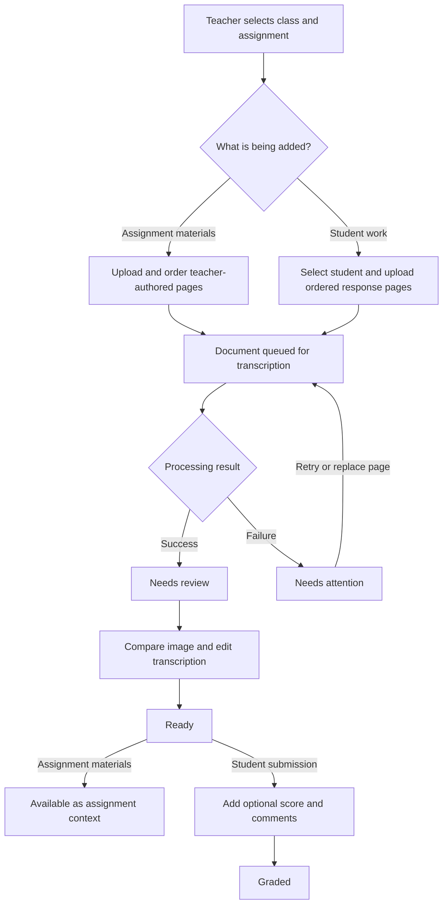

# Assignment Reader Product Requirements Document

## Document purpose

This document defines the product requirements and boundaries for the first Assignment Reader release. It describes the user problem, intended experience, and minimum product behavior. It is not an implementation plan.

## Introduction

Teachers routinely work with paper from both sides of an assignment: the prompt, instructions, or worksheet they created, and the completed work returned by students. They must sort, read, grade, and track those pages across limited planning time. Handwriting, erasures, cramped layouts, multi-page responses, and math notation make that work slower and more tiring. Paper also makes it difficult to keep the assignment context beside each response or see which submissions still require attention without maintaining a second tracking system.

Assignment Reader lets a teacher photograph assignment materials and student work, convert both into readable and editable content, verify each transcription against the original pages, and track student submissions through grading. Work is organized under the teacher's classes, assignments, and students so the assignment itself and each submission have durable digital records.

## Problem

The primary problem is not merely converting handwriting into text. Teachers need a trustworthy workflow that keeps photographed assignment materials and student work in the correct class and assignment context, makes difficult content easier to read, preserves every original source, and shows what remains to be reviewed or graded.

### Pain points

- Teachers spend significant time deciphering handwriting rather than evaluating the response.
- Teachers may need separate tools to digitize a paper assignment and its student responses, making it harder to review the response in the context of the prompt.
- Multi-page work can become separated, reordered, or mixed with another student's work.
- Camera rolls and generic file storage do not represent classes, assignments, students, or grading progress.
- OCR and vision models make mistakes, especially with handwriting, math, diagrams, erasures, and unusual layouts.
- A transcription that hides uncertainty can change the meaning of a student's response and undermine teacher trust.
- Interrupted grading sessions make it difficult to remember which submissions still need review or grading.

### Competitive landscape

- **[Gradescope](https://guides.gradescope.com/hc/en-us/articles/24838908062093-AI-assisted-grading-and-answer-groups):** Supports uploaded handwritten work, rubrics, and AI-assisted answer grouping for fixed-template assignments. Its AI handwriting support is oriented toward constrained answer regions and grouping similar answers rather than converting an entire submission into a teacher-editable document.
- **[Google Classroom](https://support.google.com/edu/classroom/answer/6020279?hl=en):** Provides broad class, roster, assignment, grade, and feedback management. It is a learning-management workflow, not a focused side-by-side transcription and correction experience for photographed paper.
- **[Pen to Print](https://www.pen-to-print.com/handwriting-ocr/how-to/):** Converts handwriting images into editable text and presents the conversion beside the original scan. It addresses transcription, but not the teacher-specific relationship among classes, assignment materials, students, submissions, and grading progress.

### Product opportunity

Assignment Reader combines the useful parts of handwriting OCR and classroom organization without attempting to become a full learning-management system. Its product advantage is a teacher-controlled review workflow for both sides of the assignment: editable assignment materials provide context, readable student transcriptions support review and grading, and every original page remains the source of truth.

## Objective

Enable a teacher to turn photographed assignment materials and handwritten student work into organized, editable digital records that are easier to read and review, without surrendering interpretation or grading judgment to the transcription model.

### Product principles

1. **The original is authoritative.** Every transcription, whether assignment material or student work, must remain verifiable against its source image.
2. **The teacher stays in control.** The model produces a draft; the teacher corrects assignment and submission transcriptions and grades student work.
3. **Organization is part of the product.** Transcription without class, assignment, student, document type, and status context does not solve the tracking problem.
4. **Failure must be visible.** Unreadable or untranscribable content must fall back to the source image rather than be silently invented or omitted.
5. **Assignment context and student work remain distinct.** Teacher-authored materials provide context; they are not student submissions and are never graded.
6. **The first release creates a reliable foundation, not speculative downstream features.**

## Audience

The primary audience is teachers who create or adapt paper assignments and collect handwritten student work, especially:

- Elementary teachers grading recurring batches of handwritten worksheets.
- Secondary teachers reviewing longer, multi-page responses across several classes.
- Special-education and learning-support teachers who need to interpret difficult-to-read work carefully and verify it against the source.

Students are represented as teacher-managed roster records in this release. They are not product users and do not have accounts. Teachers perform all uploads, including uploads of student work.

## Solution

- Teachers organize work by class and assignment. Each assignment can include optional photographed assignment materials, such as a prompt, instructions, or worksheet, and can contain separate student submissions with one or more photographed pages. The product asynchronously transcribes both document types into readable, editable content while retaining every original image as the fallback when content cannot be faithfully represented.
- One workspace per document presents each original page beside its WYSIWYG transcription. Teachers correct and verify assignment materials and student submissions there, refer to assignment materials while reviewing a submission, and move student work through **Needs review → Ready → Graded** on the same surface — grading is not a separate screen. Assignment materials use **Needs review → Ready** and are never graded.
- When grading student work, teachers may add an optional score and comments. Transcription uses a backend-selected, configurable vision provider and model; end users do not choose the model.

### Differentiators

- Teacher-authored assignment materials and student work share one assignment context without being conflated.
- Multi-page assignment materials and multi-page student work are each handled as ordered documents.
- Source images and editable transcriptions remain together, preserving context and teacher control.
- Assignment materials remain available while a teacher reviews student work.
- Explicit review and grading statuses make unfinished work visible.
- Verification and grading share one workspace, keeping the original page beside the score.
- Best-effort text and math transcription improves readability without discarding the original pages.
- The transcription provider and model can be changed operationally as quality, latency, and cost evolve without exposing model selection to teachers.

## MVP capabilities

### 1. Teacher-managed class hierarchy

A signed-in teacher can:

- Create, rename, view, and archive classes.
- Add, rename, and remove student records within a class.
- Create assignments within a class.
- Optionally define an assignment's maximum score.
- View assignment materials and student submissions within the correct class and assignment context.

The roster remains intentionally simple. It does not include student authentication, invitations, guardian relationships, enrollment synchronization, or school information system integration.

### 2. Assignment-material upload

A teacher can:

- Add optional teacher-authored source pages to an assignment without associating those pages with a student.
- Upload one or more photographed prompts, instruction pages, worksheets, or reference pages as an ordered assignment-material document.
- Review and change page order before transcription begins.
- See upload and processing progress without keeping the upload view open.
- Retry or replace failed pages without recreating the assignment.

Each original image remains attached to the assignment after transcription. Assignment materials provide context only; they are not submissions and do not receive scores or grading comments.

### 3. Student submission creation and page upload

A teacher can:

- Create a submission for a student under an assignment, whether or not the assignment has uploaded materials.
- Upload one or more photographed pages to the same submission.
- Review and change page order before transcription begins.
- See upload and processing progress without keeping the upload view open.
- Retry a failed page or submission without recreating its class, student, and assignment context.

Each page's original image remains attached to the submission after transcription.

### 4. Asynchronous transcription

For both assignment materials and student submissions, the product must:

- Process uploaded pages asynchronously.
- Produce one ordered, editable draft for the uploaded document.
- Make a best effort to preserve paragraphs, lists, line breaks, and math notation that materially affect meaning.
- Avoid claiming that diagrams, drawings, or illegible content were transcribed when they were not.
- Preserve the source image as the fallback for content that cannot be represented faithfully.
- Expose processing failures to the teacher with a retry path.
- Keep processing and review states independent for assignment materials and each student submission.

Transcription model selection is an operator concern. The teacher does not choose a provider or model in the application.

### 5. Side-by-side review, editing, and grading

The review workspace — one screen per document — must:

- Identify whether the teacher is reviewing assignment materials or a student's submission.
- Display the original page image and corresponding transcription together.
- Support page-by-page navigation for multi-page documents.
- Provide a WYSIWYG editor for correcting the transcription.
- Preserve teacher edits as the authoritative digital version.
- Never overwrite teacher edits silently if transcription is retried.
- Allow the teacher to move assignment materials or a submission to **Ready** after review.
- Host grading for student submissions in the same workspace: the optional score, comments, **Mark Ready**, **Mark graded**, and the return to **Needs review** all happen on this one screen.
- Gate grading on verification: **Mark graded** becomes available only after the submission reaches **Ready**, and **Ready** requires review of the full document.
- Keep the assignment materials available on demand while the teacher reviews a student submission.

The goal is not to guarantee perfect automatic transcription. The goal is to make correction faster and safer than reading and manually reproducing the paper alone.

### 6. Grading and tracking

Grading happens inside the review workspace defined in capability 5; this capability defines the grading rules, lifecycle, and tracking. A teacher can:

- See submissions grouped by class and assignment.
- Identify assignment materials and submissions that are processing, need review, or are ready.
- Identify student submissions that are graded.
- Add an optional numeric score to a student submission.
- Add optional free-form comments to a student submission.
- Mark a reviewed student submission as graded.
- Return assignment materials or a submission to **Needs review** if more verification is required; a returned submission must no longer appear as graded.

Assignment materials cannot be graded and are excluded from student grading counts.

### 7. Operator-controlled model configuration

The product must support a backend-configured vision provider and model, following the same operational principle as the existing OpenRouter-based prompting capability:

- Provider credentials and model selection are not exposed in the frontend.
- A model can be changed without requiring teachers to alter their workflow.
- Only models capable of accepting the supported image inputs may be selected.
- Quality, processing failure, latency, and per-page cost must be observable by document type so the product team can compare and tune models.

This requirement defines product behavior, not a specific provider commitment. OpenRouter is the initial integration pattern, not an end-user feature.

## Product workflow

## State model

Processing, review, and grading are separate concepts. Each assignment-material document and student submission has its own processing and review state; grading applies only to student submissions.

### Processing state

- **Uploading:** One or more source pages are still being stored.
- **Queued:** Upload is complete and transcription is waiting to start.
- **Transcribing:** The model is processing the document.
- **Completed:** An editable draft is available.
- **Failed:** Processing did not produce a usable draft; the teacher can retry or replace affected pages.

Transcription runs page by page. Each page carries its own processing state within its document's state, and a page becomes reviewable and editable as soon as its own draft completes, while later pages in the same document continue processing.

### Review state

- **Needs review:** A draft exists but has not been verified by the teacher.
- **Ready:** The teacher has reviewed the transcription. Assignment materials are marked as verified context; a student submission is ready to grade or finish grading.

### Submission grading state

- **Not graded:** The teacher has not completed grading the student submission.
- **Graded:** The teacher has completed grading the student submission. A score is optional.

The teacher-visible progression for a student submission is **Needs review → Ready → Graded**, but the underlying states remain separate so processing never implies review and assignment materials can never become graded.

## Core product concepts

- **Class:** A teacher-owned grouping of students and assignments.
- **Student:** A teacher-managed roster record; not an authenticated user.
- **Assignment:** Work assigned within one class, with an optional maximum score, optional assignment materials, and student submissions.
- **Assignment materials:** Teacher-authored source pages for an assignment, including original images, review state, and editable transcription; not associated with a student and never graded.
- **Submission:** One student's work for one assignment, including review and grading status, optional score, and comments.
- **Document page:** One ordered source image within assignment materials or a student submission.
- **Transcription:** The generated draft and subsequent teacher-edited digital content associated with assignment materials or a student submission.

## Personas

### Persona 1: Elena Ellis — Third-grade classroom teacher

#### Bio and demographics

- Teaches one self-contained class of approximately 20–28 students.
- Grades recurring batches of handwritten work across several subjects.
- Works in short, interrupted grading windows using a school laptop or tablet and a phone camera.

#### Quotes

- “A few unclear words or numbers can turn grading into detective work.”
- “I need to see what is unfinished without maintaining another spreadsheet.”
- “If the transcription gets something wrong, I want to compare it with the photo and fix it.”

#### Pain points

- Paper batches are easily mixed or separated.
- Uneven handwriting, erasures, and handwritten math slow down grading.
- Multi-page work can be reviewed out of order.
- Interrupted grading makes progress hard to track.
- Paper prompts and worksheets are not always available digitally beside the responses she is grading.

#### How Assignment Reader helps

- Keeps each photographed submission under the correct class, student, and assignment.
- Treats several page images as one ordered submission.
- Provides a readable draft while retaining every source image.
- Makes unfinished work visible through explicit statuses.
- Keeps the assignment prompt available while she checks each student's response.

### Persona 2: Marina Morales — Secondary humanities teacher

#### Bio and demographics

- Teaches multiple sections and approximately 100–120 students across two course preparations.
- Reviews long, handwritten responses and grades in limited evening or weekend blocks.
- Prioritizes reliable organization and reduced reading fatigue, not automated judgment.

#### Quotes

- “A six-page handwritten response takes a focused block I often do not have.”
- “I need to see which submissions still need my attention without rebuilding a spreadsheet.”
- “If a symbol or crossed-out sentence is unclear, show me the original instead of pretending the transcription is right.”

#### Pain points

- Multi-class paper piles make it difficult to find ungraded work.
- Dense handwriting and long responses create reading fatigue.
- Page-order mistakes and omissions are easy to miss.
- Imperfect text and notation must be checked against the original.
- Long prompts or source texts are cumbersome to keep open beside every paper response.

#### How Assignment Reader helps

- Separates work by class, assignment, student, and grading status.
- Combines multi-page photos into one reviewable record.
- Lets her verify and correct the digital draft page by page.
- Supports optional scores and comments after review.
- Keeps long-form prompts and source texts accessible while she reviews each response.

### Persona 3: Lena Brooks — Learning-support teacher

#### Bio and demographics

- Supports students across several middle-school classes and reviews work in short blocks between instruction, meetings, and documentation.
- Regularly works with handwriting, spelling, diagrams, layouts, and notation that require careful interpretation.
- Is comfortable with school software but does not trust an opaque transcription as evidence of what a student wrote.

#### Quotes

- “I need to know what the student actually put on the page, not what a clean-up tool thinks they meant.”
- “If the transcription is unclear, show me the image and let me fix it.”
- “My first job is to understand the response faithfully and apply my own judgment.”

#### Pain points

- A small transcription error can change the meaning of a response.
- Manually copying text from images is slow and can introduce new errors.
- Switching between separate image and note tools adds friction.
- Work still needing verification must not appear ready or graded.
- Teacher-provided context and student-authored evidence can be confused when stored in the same generic image tool.

#### How Assignment Reader helps

- Keeps original images and editable content in the same workspace.
- Treats the image as the source of truth for unclear content.
- Requires an explicit review step before the work becomes ready.
- Records the teacher's score and comments without attempting diagnosis or automatic assessment.
- Separates teacher-provided context from student-authored content so the source of each transcription is clear.

## Launch acceptance criteria

The MVP is product-complete when a teacher can:

1. Create a class, add students, and create an assignment.
2. Add, order, and transcribe multiple photographed assignment-material pages without associating them with a student.
3. Create a student submission containing multiple ordered page images under the same assignment.
4. Leave either upload flow while transcription runs and later see whether it completed or failed.
5. Review each original image beside editable transcribed content for both assignment materials and student submissions.
6. Correct either transcription without losing access to the original page or silently losing prior teacher edits.
7. Access assignment materials while reviewing a student submission.
8. Move assignment materials from Needs review to Ready and a student submission from Needs review to Ready to Graded.
9. Record an optional score and comments only on a student submission, within the same workspace where its transcription is verified.
10. Identify outstanding review and grading work by class and assignment without counting assignment materials as student work.

The product team must also be able to change the configured vision model without exposing model selection to teachers or changing either teacher workflow.

## Success measures

Initial product measurement should establish baselines before fixed targets are set. Track:

- Median time from completed upload to editable draft, segmented by assignment materials and student submissions.
- Transcription failure and retry rate by document type.
- Percentage of processed assignment materials that reach Ready, percentage of processed submissions that reach Ready, and percentage of submissions that reach Graded.
- Teacher correction activity per processed page, segmented by document type, as a proxy for transcription usefulness.
- Time teachers spend reviewing assignment materials and student submissions compared with their existing paper workflow.
- Percentage of assignments with uploaded materials and percentage of submission-review sessions in which those materials are opened.
- Per-page model cost, segmented by configured model and document type.
- Teacher-reported trust in the side-by-side review experience.

A low edit rate alone is not proof of accuracy; it must be considered alongside teacher review behavior and reported trust.

## Out of scope for the initial release

- AI-generated grades, grading recommendations, or automatic feedback.
- Rubric creation or rubric-based grading.
- Assignment generation, rewriting, or instructional-content recommendations.
- Automatic comparison of student work with assignment materials, including answer matching or correctness judgments.
- Analytics about student performance or learning outcomes.
- Question extraction, answer grouping, or answer-key generation.
- Student, guardian, or school-administrator accounts.
- Student uploads, invitations, join codes, or teacher-to-student sharing.
- Parent sharing, exports, or learning-management-system integrations.
- OCR confidence scores or automatic highlighting of uncertain words.
- Class roster synchronization or student information system integration.
- Model selection controls in the teacher-facing application.
- Cross-assignment libraries, reuse, search, or template management for assignment materials.

## Risks and constraints

### Transcription accuracy

Handwriting, page quality, math notation, diagrams, and erasures will produce variable results. The side-by-side review experience and retained source images are mandatory mitigations; the product must not present generated text as guaranteed truth.

### Privacy and school policy

Student work may contain names and other education-related information. Assignment materials may also contain sensitive instructions, answer content, or third-party material. Source images and required context may be sent to OpenRouter and the selected model provider. Before launch, ClassPrints must define and disclose provider processing, retention, deletion, and account-deletion behavior for both document types, and update its privacy and terms language accordingly. The product must not claim compliance with a school or legal regime solely because a provider is used.

### Cost and model quality

Per-page vision processing creates a recurring variable cost. Backend model configuration and operational measurement are required so the team can balance quality, latency, reliability, and cost. Subscription quotas or usage limits may be needed later, but pricing and packaging are not part of this release.

### Hierarchy overhead

The class and roster hierarchy adds setup work before the teacher reaches transcription. The MVP must keep roster entry intentionally simple, allow assignment materials to be transcribed without first creating a student submission, and avoid expanding into full classroom administration.

### Document identity and historical context

Assignment materials and student work must remain visibly distinct so a teacher cannot mistake a prompt for student evidence. Replacing assignment materials after submissions exist must not silently change or hide the context previously used to review those submissions.

### Model changes

Different models may produce different formatting and interpretation. A configuration change must not alter or overwrite existing teacher-edited assignment materials or submissions.

## Resolved product decisions

The product behaviors below were open questions during planning and have been decided. The implementation plan must treat these decisions as requirements rather than choices:

1. Supported source formats and limits, including whether the first release accepts HEIC and PDF in addition to JPEG and PNG.
    - **Decision:** The first release accepts JPEG, PNG, and HEIC. HEIC images are normalized to JPEG server-side before storage and transcription. PDF is not accepted in this release. Page and image size limits are decided under item 2.
    - **Rationale:** HEIC is the default phone-camera format, so rejecting it would add friction for teachers photographing with phones. Server-side normalization gives the review workspace and the transcription provider one standard image format. PDF support requires page rasterization and a multi-page import flow that conflicts with the photograph-and-order upload model, so it is deferred.

2. Maximum pages and upload size for assignment materials and for each student submission.
    - **Decision:** Both document types share one limit set: a maximum of 20 pages per document and 10 MB per source image.
    - **Rationale:** A uniform limit covers long multi-page responses, such as a six-page handwritten essay, with headroom while capping recurring per-page transcription cost. One limit for both document types keeps the mental model simple, and assignment materials rarely need more.

3. Retention period for original page images and what deletion actions are available to teachers for each document type.
    - **Decision:** Original page images are retained for the life of their parent record; there is no automatic time-based retention period in this release. A teacher can delete a single page, an entire assignment-materials document, or an entire student submission. Deleting an assignment or class cascades to its documents, and account deletion removes all content.
    - **Rationale:** Automatic purge windows would contradict the principle that the original is authoritative and would be speculative scope. The provider processing, retention, and deletion disclosure required before launch (see Privacy and school policy) remains a separate launch blocker.

4. Whether score accepts decimals and how an assignment's maximum score is displayed.
    - **Decision:** A score accepts up to two decimal places. When the assignment defines a maximum score, scores display as "8.5 / 10" and a score above the maximum is rejected with a clear error; without a maximum score, the value displays alone. No percentage conversion is performed.
    - **Rationale:** Real grading uses halves and quarters, so integer-only scores would force workarounds. Hard validation against the maximum keeps the optional maximum meaningful.

5. Whether teachers may begin editing completed pages while remaining pages in the same document are still processing.
    - **Decision:** Yes. Transcription runs per page, and a page becomes reviewable and editable as soon as its own draft is ready while later pages in the same document continue processing. A document reaches Needs review only when every page is complete, and Ready still requires review of the full document.
    - **Rationale:** Per-page readiness shortens interrupted grading sessions without weakening the review gate.

6. Whether a retry applies to one failed page or reprocesses the entire document by default.
    - **Decision:** The default retry reprocesses only the failed page. A separate explicit action retranscribes the entire document, for example after a model change. Whole-document retranscription requires confirmation and, if any page has teacher edits, explicit consent to overwrite them. Teacher edits are never overwritten silently.
    - **Rationale:** Per-page retry avoids re-billing pages that already succeeded, keeping recurring per-page cost contained. The confirmation path satisfies the rule that a retry must not silently overwrite teacher edits.

7. Whether archived classes and removed students retain their historical assignment materials and submissions.
    - **Decision:** Yes. Archiving a class makes it read-only: its assignments, materials, and submissions remain viewable, and no new uploads or edits are allowed. Removing a student retains that student's submissions under their assignments so grading records and review history remain intact, and the teacher can explicitly delete a student's data.
    - **Rationale:** Historical grading records must not silently disappear, and explicit deletion supports teachers with privacy obligations.

8. Whether assignment materials may be replaced after student submissions exist, and how prior versions remain available.
    - **Decision:** Replacement is allowed and creates a new version of the materials document. Prior versions remain viewable in read-only form, and no submission's recorded review context changes retroactively.
    - **Rationale:** This resolves the document-identity risk: replacing assignment materials after submissions exist must not silently change or hide the context previously used to review those submissions.

9. Whether the first release supports only one ordered assignment-material document per assignment or multiple named versions or attachments.
    - **Decision:** The first release supports exactly one ordered assignment-materials document per assignment. Replacing materials creates a new version of that document. Multiple named versions or attachments are out of scope.
    - **Rationale:** Versioning covers the legitimate replacement case; multiple named attachments would be speculative scope for this release.

10. Whether assignment materials may include answer keys or rubrics and, if so, whether they require additional visibility controls.
    - **Decision:** Teachers may upload answer keys or rubrics as ordinary assignment-material pages, with no additional visibility controls. Rubric-based grading remains out of scope.
    - **Rationale:** Students have no accounts and the teacher is the only viewer of the product, so visibility controls would guard a threat that does not exist. The pre-launch provider disclosure must explicitly name answer-key content among the material sent to the transcription provider.

11. Whether transcription review and grading are separate screens or one workspace.
    - **Decision:** One workspace per document. The teacher verifies each transcription beside its original and, for student submissions, records the optional score and comments in that same workspace; **Needs review → Ready → Graded** are states on one surface, not separate screens. Assignment materials use the same workspace without a grading panel, and grading requires that the submission first reaches **Ready**.
    - **Rationale:** Verification and grading are one attention loop — teachers check the original while judging the work, so separate screens duplicated context (a grading screen could show only a transcription excerpt) and added navigation. The verification gate survives as a state requirement rather than a change of place.
